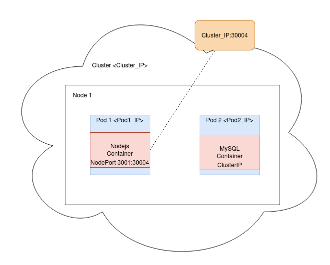

# MDImagesCloud
If you want to run only the application assuming that you have a ready mysql database up and running, first thing you have to change the db credentials inside the `index.js` file.

```
cd app
npm install
npm start
``` 

### Docker
This option is when you want to run the application along with a mysql database into docker containers. 

First we need to install the node packages because of the volume of the app container.
```
cd app
npm install
cd ..
```

Initialize and run the containers with `docker-compose up`.

You can delete the containers with `docker-compose down` 

You can start and stop the containers with `docker-compose start/stop`

And then type `localhost:3004` to your browser to access into the app 

### Kubernetes 
This option is for running this containers inside a cluster. Tested with kubernetes minikube for single node cluster

The architecture of the cluster is very simple as it seems at the diagram below

<div style="text-align: center"></div>

To be able to create the cluster, execute the following commands:
```
sudo apt-get install conntrack -y
sudo minikube start --driver=none
```
I use the "none" driver as I don't want to create another VM or Docker container.

Now deploy the pod with the database. 

* Change the hostPath inside db.yaml file. Provide the path of the sql script for the initialization of the DB. e.g. `/Downloads/$USER/MDImagesCloud/db`

TODO: I assume that there is a better and more automated way to do that, but for now I am using this one.

```
kubectl apply -f db.yaml
```

Now, check the cluster-ip of the new mysql service with `kubectl get svc mysql`. Go to `app/index.js` and replace this ip for the mysql connection credentials.

* Rebuild (if you have already built) the app container with dokcer-compose. Finally, deploy the node js application 

```
kubectl apply -f app.yaml
```

* Check all the parts of the cluster: `kubectl get all`

* Access into the app with `localhost:30004` or `cluster-ip:30004` from outside the cluster.

TODO: 
1. Find a better way to mount the initial sql script inside the mysql pod
2. Use a networking component (a bridge or something) to automate the routing inside the cluster. Maybe beacause all the services are inside the same namespace, I could just use the label tag of the service or something?
3. Test the db-pv.yaml to create a persistent volume for the mysql database. This way we could have more than one instances of the mysql database with the same data.
4. Test multi-node cluster
5. Add more features to the App like persist some basic data for each user just to test the functionality of the persistent volume